# Regex Tutorial : Validating Emails

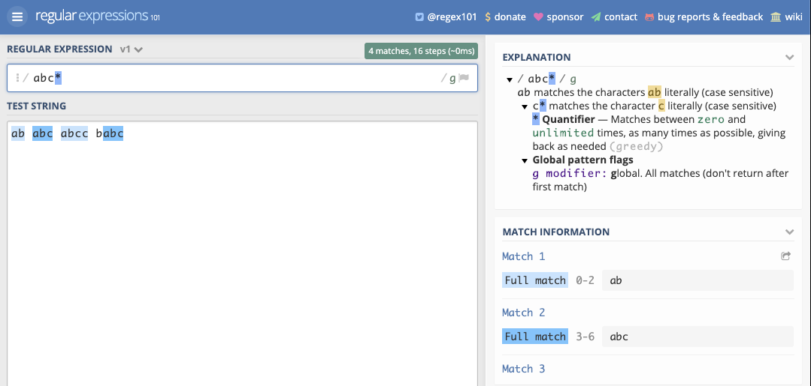  
In this tutorial I will explain how to use Regex or Regular Expressions and its components needed to validate a basic email.

---

### Table of Contents

- [Break Down](#break-down)
- [Flags](#flags)
- [Bracket Expressions](#bracket-expressions)
- [OR Operator](#or-operator)
- [Literal Characters](#literal-characters)
- [Quantifiers](#quantifiers)

---
---

## Break Down

So lets break this into 3 parts as shown below

>[ 1 ] + [ 2 ] + [ 3 ]{}  
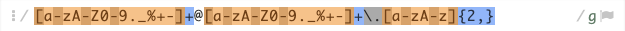

>[ 1 ] Look for lowercase strings from **a to z**, uppercase **A to Z**, numbers **0 to 9**, the literal period character, underscore, percentage, plus sign, and dash/minus sign thats followed by an **@** sign 
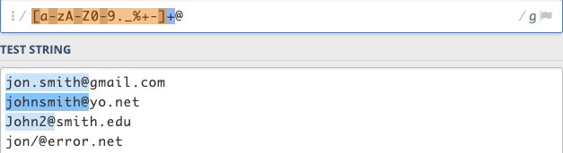

>[ 2 ] with another string of characters containing lowercase strings from **a to z**, uppercase **A to Z**, numbers **0 to 9**, the literal period character, underscore, percentage, plus sign, and dash/minus sign thats followed by a literal dot **.** sign 
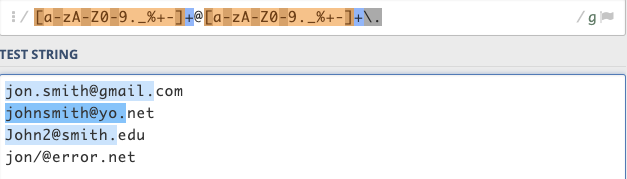

>[ 3 ] then finally followed by string with lowercase **a to z** and uppercase **A to Z** with a minimum of 2 letters and maximum of infinity 
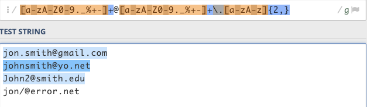  
Notice how **jon?@error.net** email wasn't validated?  
>The question mark character was not added in the first brackets. The Regex would need to look like this 
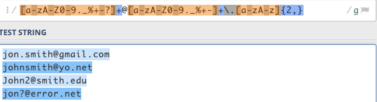

[Back to the top](#table-of-contents)

---
---

## Regex Components

Regular Expressions are used to extract information from any text by searching for one or more matches of specific patterns and/or characters. Lets create a simple Regex expression to validate these emails using the methods below. 

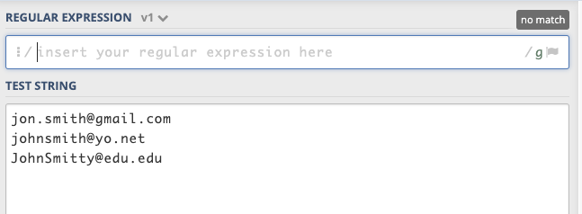

---

### Flags

the Regex starts and ends with **/ /** . The **/g** at the end represents global, does not return after the first match, restarting the subsequent searches from the end of the previous match. 
>/abc/g

---

## Bracket Expressions

>[a-z0-9]  
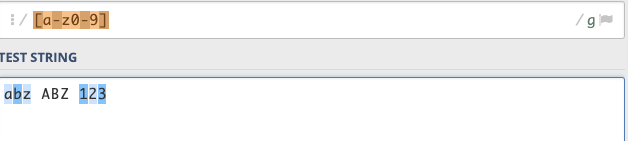  
This means to find a string from **a to z**. The same would go anything else you add between the brackets such as numbers **0 to 9**. 

We could also include other characters such as 

>[_%] 
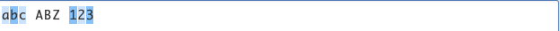 
which means look for an underscore _ . Notice how there are no space between each character.Adding a space would cause the Regex to look for empty spaces.

[Back to the top](#table-of-contents)

---

### OR Operator []

> a[bt] 
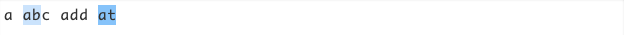 
This means to look for a string of characters with an a followed by **b or t**.

---

### Literal Characters

> [a-z\+] 
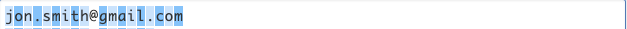 
Enclosing strings and characters in brackets does something special. In this example it means to look for lowercase strings from **a to z** & the plus sign character. Keep in min that with out the dash it would mean to look for single characters.

On the other hand 

>[a-z]+@ 
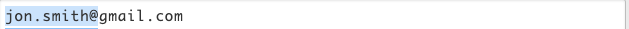 
Having the + outside the brackets means look for a string of characters **a to z** that is followed by an **@** sign.

---

### Quantifiers

>[ab]{2,3} 
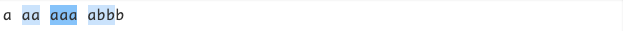 
The {2,3} means to look matches of between [ab] with a min of 2 to a max of 3 times, as many times as possible.

[Back to the top](#table-of-contents)

---

## Author Info

Osborn Roxas | [Github Account](https://github.com/osbornroxas02/readMe-maker/tree/develop)
| [Email Address](https://OSBORNROXAS02@GMAIL.COM) |

---

[Back to the top](#table-of-contents)
